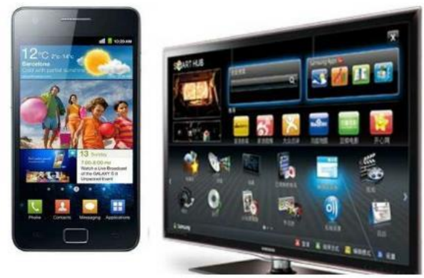

# 第一课：认识电脑

### 电脑的用途

> 计算机，就是普通意义上的电脑。最常见的有台式机和笔记本（个人掌上电脑PC）；

1. 编辑文字  -- Word等文字处理软件；
2. 编辑图片 -- window自带的图片编辑器、ps等；
3. 娱乐         -- 听歌、看电影、玩游戏等；
4. 科研         -- 编程。
5.  ...

### 各式各样的电脑

1. 台式电脑

2. 笔记本电脑

3. 平板电脑

4. 智能手机和智能电视

### 认识点电脑的硬件组成

> 我们这里只讲外设及使用

1. 主机 -- 开机键、光驱、各种接口等

2. 外设 

    -- 输入设备：键盘、鼠标、话筒、手写板等；

​       -- 输出设备： 显示器、打印机、音箱等

# 实操

1. 电脑开机、重启、关机；
2. 鼠标的使用方法

3. 键盘：

 指法：

练习：在桌面建立一个文本文档，练习键盘打字。

### 主键盘区常用按键汇总：

> 这里所列按键功能为该键最基本的入门功能，进阶功能在需要时请查阅相关文档

Esc：取消键

F1：帮助键（打开帮助文档）

F5：刷新

F11：全屏显示

Tab：制表键（一次缩进4或者8个空格）

caps lock: 大写锁定键

shift：换挡键（输入法大小写切换）

Ctrl：（组合键使用）

enter：回车键（确定键）

Backspace：退格键（理解为删除键，实际键盘上有专门的一个删除键）

win：打开软件入口

## 附录：

> office 入门学习教程

[MS office入门基础精品课_word_  ——哔哩哔哩_bilibili](https://www.bilibili.com/video/BV1B7411d7QU/)

[MS office入门基础精品课_Excel_——哔哩哔哩_bilibili](https://www.bilibili.com/video/BV1q7411d7Qa/)

[MS office入门基础精品课_PowerPoint_——哔哩哔哩_bilibili](https://www.bilibili.com/video/BV1z7411d722/)

